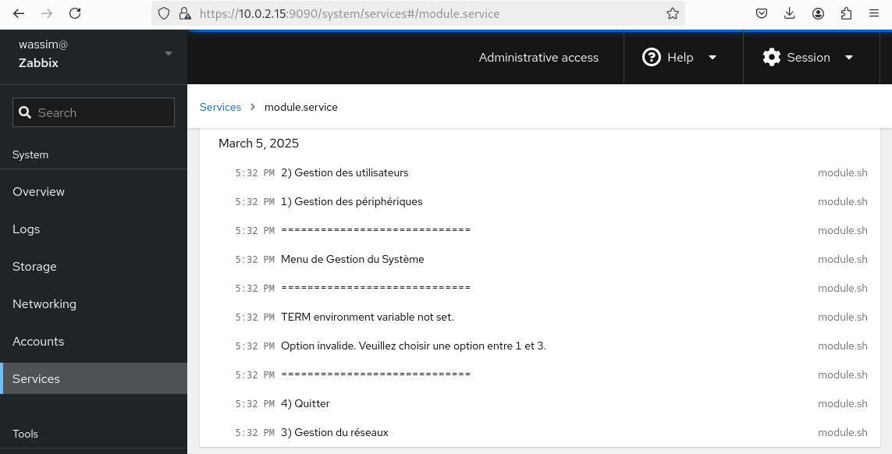

# <u>Menu interactif avec bash</u>

## <u>Le script :</u>
```bash
#!/bin/bash


if [[ $EUID -ne 0 ]]; then
   echo "Ce script doit être exécuté en tant que root." 
   exit 1
fi

while true; do
    clear
    echo "============================="
    echo "  Menu de Gestion du Système  "
    echo "============================="
    echo "1) Gestion des périphériques"
    echo "2) Gestion des utilisateurs"
    echo "3) Gestion du réseaux"
    echo "4) Quitter"
    echo "============================="
    read -p "Choisissez une option : " choix

    case $choix in
        1)
            
            while true; do
                clear
                echo "============================="
                echo "  Menu de Gestion des Périphériques  "
                echo "============================="
                echo "1) Lancer btop"
                echo "2) Lancer htop"
                echo "3) Afficher les processus"
                echo "4) Informations sur le disque"
                echo "5) Utilisation du disque"
                echo "6) Retour au menu principal"
                echo "============================="
                read -p "Choisissez une option : " periph

                case $periph in
                    1)
                        btop
                        ;;
                    2)
                        htop
                        ;;
                    3)
                        ps -ef
                        ;;
                    4)
                        df -h
                        ;;
                    5)
                        echo "Entrez le chemin complet du disque : "
                        read the_disk
                        du -h $the_disk
                        ;;
                    6)
                        break  
                        ;;
                    *)
                        echo "Option invalide. Veuillez choisir une option entre 1 et 6."
                        ;;
                esac
                read -p "Appuyez sur Entrée pour continuer."
            done
            ;;
        2)
            
            while true; do
                clear
                echo "============================="

                echo "  Menu de Gestion des Utilisateurs  "
                echo "============================="
                echo "1) Ajouter un utilisateur"
                echo "2) Supprimer un utilisateur"
                echo "3) Afficher un utilisateur"
                echo "4) Retour au menu principal"
                echo "============================="
                read -p "Choisissez une option : " gestion

                case $gestion in
                    1)
                        echo "Entrez le nom de l'utilisateur à ajouter : "
                        read uname
                        useradd -m $uname && echo "Utilisateur $uname ajouté avec succès." || echo "Erreur lors de l'ajout."
                        ;;
                    2)
                        echo "Entrez le nom de l'utilisateur à supprimer : "
                        read uname
                        userdel -r $uname && echo "Utilisateur $uname supprimé avec succès." || echo "Erreur lors de la suppression."
                        ;;
                    3)
                        echo "Entrez le nom de l'utilisateur à afficher : "
                        read uname
                        cat /etc/passwd | grep $uname
                        ;;
                    4)
                        break  
                        ;;
                    *)
                        echo "Option invalide. Veuillez choisir une option entre 1 et 4."
                        ;;
                esac
                read -p "Appuyez sur Entrée pour continuer."
            done
            ;;


	3)
		while true; do
                clear
                echo "============================="
                echo "  Menu de Gestion du réseau  "
                echo "============================="
                echo "1) Ajouter une addresse ip"
                echo "2) Supprimer une addresse ip"
                echo "3) Tester la connectivité réseau"
		echo "4) Trouver une addresse ip lié à un domaine"
                echo "5) Retour au menu principal"
                echo "============================="
                read -p "Choisissez une option : " reseau

                case $reseau in

		1)
		   echo "Ajouter une addresse ip"
		   echo "Entrer l'ipv4: "
		   read ipv4
   		   echo "Entrer le masque sous-réseau (format /): "
	           read netmask_
    		   echo "Entrer l'interface réseau: "
    		   read interface
   		   if ip link show "$interface" > /dev/null 2>&1; then
      			  ip addr add $ipv4/$netmask_ dev $interface
    		   else
       			   echo "Cette interface n'existe pas"
    		   fi
   		   ;;

		2)
		   echo "Supprimer une addresse ip" 
		   echo "Entrez l'ipv4 : "
                   read ipv4
                   echo "Entrez le masque sous-réseau (format /) : "
                   read netmask_
                   echo "Entrez l'interface réseau : "
                   read interface
                   if ip link show "$interface" > /dev/null 2>&1; then
                          ip addr del $ipv4/$netmask_ dev $interface
                   else
                           echo "Cette interface n'existe pas."
                   fi
                   ;;		

	  	3)
		echo "Tester la connectivité réseau"
		read -p "Entrez l'addresse ip ou le nom du domaine : " ip_domain
		ping $ip_domain
		;;
		
		4)
		echo "Récuperer l'addresse ip d'une nom de domaine"
		read -p "Entrez le nom de domaine" dom
		nslookup $dom
		;;
		
		5)
                        break  
                        ;;
                 *)
                        echo "Option invalide. Veuillez choisir une option entre 1 et 5."
                        ;;
                esac
                read -p "Appuyez sur Entrée pour continuer."
            done
            ;;

		                


        4)
            echo "Au revoir !"
            exit 0
            ;;
        *)
            echo "Option invalide. Veuillez choisir une option entre 1 et 4."
            ;;
    esac
    read -p "Appuyez sur Entrée pour continuer."
done
```

## <u>Fonctionnement du script :</u>

Ce script Bash interactif permet de gérer différentes fonctionnalités du système via un menu structuré. Il propose trois grandes catégories :

        1) Gestion des périphériques (processus, utilisation du disque, monitoring avec btop et htop).
        2) Gestion des utilisateurs (ajout, suppression et affichage d’un utilisateur).
        3) Gestion du réseau (ajout/suppression d’adresse IP, test de connectivité, résolution DNS).

Le script fonctionne avec une boucle principale qui affiche un menu général et attend une saisie de l’utilisateur. Selon le choix effectué, une seconde boucle affiche un sous-menu correspondant, géré via une structure case. Chaque option exécute la commande système appropriée.

Le script tourne en boucle jusqu’à ce que l’utilisateur choisisse explicitement l’option "Quitter" (option 4) ou force l’arrêt avec Ctrl + C.

## <u> Cockpit :</u>


